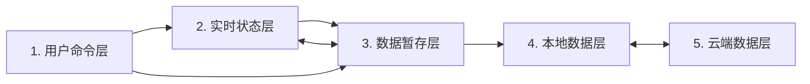

# 持久化模块公共契约

## 1. 文档边界

本文是所有持久化模块长期遵守的公共契约，只说明五层状态、模块如何使用 SDK，以及各类命令成功或失败后的可观察结果。它不解释 IndexedDB 记录、Git Data API、CAS、轮询器或 Shared 内部类。

维护已有模块时阅读本文和该模块文档。首次接入才阅读 [新持久化模块接入指南](./new-persistent-module-guide.md)；获准维护 Shared 时阅读 [Shared 与平台维护规范](./shared-maintenance.md)。不持久化的模块不需要本文。

“必须”和“不得”是硬约束；“应该”是通常遵守的设计约束。

## 2. 五层状态模型

模块中的数据按寿命和职责分为五层：



| 层         | 持有什么                                                | 典型寿命           |
| ---------- | ------------------------------------------------------- | ------------------ |
| 用户命令层 | 用户此刻想做的事                                        | 一次命令           |
| 实时状态层 | 正在编辑、拖拽、选择或呈现的页面状态                    | 当前标签页         |
| 数据暂存层 | 当前完整业务 payload，以及用于撤销/重做的可逆业务 event | 当前标签页         |
| 本地数据层 | 已成功保存到当前设备的完整 payload                      | 跨刷新和浏览器重启 |
| 云端数据层 | 用于跨设备同步的完整 payload                            | 跨设备             |

基本方向固定为：

```text
普通编辑：用户命令 → 实时状态 → 业务 event → 数据暂存
撤销重做：用户命令 → 暂存 event 队列 → 当前完整 payload → 实时状态
本地保存：数据暂存的当前完整 payload → 本地数据
页面初始化：本地完整 payload → 空 event 队列 → 实时状态
上传：本地完整 payload → 云端数据
拉取：云端数据 → 本地完整 payload → 新会话
```

实时状态不得绕过暂存层直接保存，暂存状态也不得绕过本地层直接上传。event 只属于当前页面会话；IndexedDB 和 GitHub 都保存完整 payload，不保存撤销 event 队列。

## 3. 生命周期开始前的模块定义

### 3.1 模块身份

每个模块必须有稳定且唯一的 `moduleId`，并匹配：

```text
^[a-z][a-z0-9]*(?:-[a-z0-9]+)*$
```

模块不得自行拼接远端目录、IndexedDB 名称或编辑锁名称；这些都由 Shared 根据 `moduleId` 派生。

### 3.2 完整业务 payload

payload 表示模块的一份完整业务数据，不是 JSON 的同义词。它必须：

- 能通过浏览器 `structuredClone` 和 IndexedDB 往返保存；
- 由模块的 `validate` 校验；
- 不包含 DOM、焦点、选中、pointer、动画等纯实时状态；
- 不包含登录、保存、同步、冲突、revision 等系统元数据。

`Map`、`Set`、`Date`、`ArrayBuffer`、类型化数组和循环引用等非 JSON 值都可以成为 payload，只要模块能稳定校验、比较和编码。函数、DOM 引用、`WeakMap` 等不能可靠持久化的值不得进入 payload。

### 3.3 内容标识和远端编码

模块必须提供同步、确定的 `contentKey(payload)`：

- 业务语义相同必须得到相同字符串；
- 任何需要保存或同步的变化都必须改变字符串；
- 同一个 content key 必须编码出相同的受管文件；
- content key 必须跨刷新保持稳定。

JSON 模块应该使用 SDK 的 `defineJsonModule`，由 SDK 提供规范 JSON content key。非 JSON 模块使用 `defineModule` 并自行实现 `contentKey`。

当前远端受管文件是 UTF-8 文本，但不要求是 JSON，也可以是 Markdown、YAML、CSV 或模块自定义文本格式。`encode` 与 `decode` 必须确定、无损、可往返。

## 4. 完整生命周期

### 4.1 初始化

**触发条件**

模块页面加载，并调用 `startModuleRuntime(...)`。

**模块需要做什么**

- 提供完整的 `ModuleDefinition`、应用根节点和 hooks。
- `project(payload, "initialize")` 只能依据传入 payload 建立界面；此时不能依赖尚未返回的 runtime。
- 对真正的启动异常只显示安全、可重试的提示，不展示原始请求或凭据。

**SDK 会做什么**

- 恢复统一登录并取得该 `moduleId` 的单标签编辑权。
- 从本机完整 payload 建立会话；本机尚无记录时，使用云端完整 payload或模块的空数据。
- 以该完整 payload 作为暂存层 current，建立一条空 event 历史，然后调用 `project`。

**成功后状态**

- `ready` 返回可用 runtime；`runtime.current` 是初始化后的完整 payload。
- event 历史从零开始，`canUndo` 和 `canRedo` 均为 false。
- `blocked`、`unsupported` 和 `authentication-required` 由 SDK 呈现相应边界，模块不进入编辑状态。

**失败时保持什么不变**

- 不产生半初始化的可编辑页面，不覆盖已经存在的本机或云端数据。
- SDK 释放已经取得的公共资源；重新加载后仍可重试。

### 4.2 编辑、event 历史、撤销和重做

**触发条件**

- 一个业务动作到达模块定义的提交点，模块调用 `runtime.dispatch(event)`。
- 用户执行模块提供的撤销或重做入口，模块调用 `runtime.undo()` 或 `runtime.redo()`。

**模块需要做什么**

- 一个 event 表示一次完整业务变化，不是 DOM event；一次复合动作只 dispatch 一次。
- 明确选择正整数 `history.capacity` 或 `"unlimited"`。容量按 event 数计算，由模块根据业务决定。
- `apply`、`invert`、`validate` 和 `contentKey` 必须确定、无副作用且不修改输入。
- undo/redo 前在 `settle("undo" | "redo")` 中提交或取消实时交互；如产生业务变化，返回一个 event，否则返回 `null`。
- 在 undo/redo 后的 `project(payload, reason)` 中重建界面并重置失效的实时状态。

**SDK 会做什么**

- 暂存层始终持有一个当前完整 payload；历史只长期记录可逆的 forward/inverse event，不保存每一步完整 payload 快照。
- dispatch 时原子完成 apply、结果校验、content key 和 inverse 生成，再推进 current 与历史位置。
- 语义 no-op 不入队，也不删除 redo；撤销后 dispatch 的真实变化删除旧 redo 分支。
- 在各公共边界使用 `structuredClone` 隔离 payload 和 event。

**成功后状态**

- current 变为 event 计算出的完整 payload，撤销/重做能力随队列位置变化。
- `dirty` 只比较 current 与最近本地保存基线；内容回到该基线时自动变为 false。
- event 历史只存在于当前页面；刷新后从已保存完整 payload 重新建立空队列。

**失败时保持什么不变**

- apply、invert、validate、content key 或 clone 任一步失败时，current、队列、位置、redo 分支和保存基线全部不变。
- 失败 event 可以在模块修正后重试。

Shared 不注册键盘快捷键。模块自行决定按钮、菜单和键位，并负责在卸载时清理监听。

### 4.3 本地保存

**触发条件**

模块调用 `runtime.save()`。

**模块需要做什么**

- 在 `settle("local-save")` 中结束或取消实时交互；需要提交业务变化时返回一个 event。
- 只调用 runtime，不直接访问本地数据库。

**SDK 会做什么**

- 先按正常 dispatch 规则处理 settle 返回的 event。
- 保存期间暂时阻止应用根节点交互，但不显示云端遮罩。
- 把暂存层当前完整 payload 写入本机；event 队列仍只留在页面中且不被清空。

**成功后状态**

- 当前 payload 成为新的本地保存基线，`dirty`/`sessionDirty` 为 false。
- `localSavedAt` 更新；撤销和重做仍可继续。
- 本地内容可以已经保存但尚未上传，此时 `localChangedSinceSync` 仍为 true。

**失败时保持什么不变**

- 当前 payload、event 队列、队列位置和原本地保存基线不变，`dirty` 仍正确反映未保存状态。
- 页面恢复交互，模块可以显示安全提示并允许手动重试。

### 4.4 云端同步与冲突

**触发条件**

- 模块调用 `runtime.upload()`、`runtime.pull()` 或 `runtime.resolveConflict(direction)`。
- SDK 的轮询发现已知云端版本发生变化。

**模块需要做什么**

- 只调用 runtime，不直接访问 GitHub、revision 文件或 token。
- 在 `settle("upload" | "pull" | "remote-change")` 中结束实时交互并按需返回 event。
- 用模块自己的 UI 告知用户冲突，并且只提供 `local-wins` 与 `cloud-wins` 两个明确方向；不得暗中自动合并或覆盖。

**SDK 会做什么**

- 上传前先保证当前完整 payload 已成功保存到本机。
- 上传、拉取和覆盖期间显示统一的全页 spinner 与模糊遮罩；模块不自行实现或切换它们。
- 按以下状态决定行为：

| 云端变化 | 本地变化 | SDK 行为 |
| --- | --- | --- |
| 否 | 否 | 保持一致，不覆盖 |
| 否 | 是 | 保留本地，等待上传 |
| 是 | 否 | 拉取完整云端 payload，写入本机并建立新会话 |
| 是 | 是 | 保存冲突与本地一侧，不自动覆盖 |

**成功后状态**

- 上传成功后，本地同步基线和已知云端版本推进到本次上传内容。
- 拉取或 `cloud-wins` 成功后，以云端完整 payload 替换本机内容并建立一条新的空 event 历史。
- `local-wins` 成功后，以本机完整 payload 覆盖该模块的云端受管内容。
- 冲突可以跨刷新保留；`dirty === false` 只表示已保存到本机，不等于已经同步。

**失败时保持什么不变**

- 普通网络失败不选择冲突方向，也不丢失当前 payload、本机内容或 event 历史。
- 未完成的上传意图和已确认的冲突仍可在刷新后恢复。
- 遮罩和页面阻塞必须解除，用户可以手动重试。

### 4.5 页面结束

**触发条件**

页面发生 `pagehide`、模块在单页应用中被卸载，或凭据被 GitHub 明确判定失效。

**模块需要做什么**

- 移除模块自己注册的 DOM、键盘和其他 UI 监听。
- 页面未关闭但模块被卸载时，显式等待 `runtime.dispose()`。
- dispose 后不再读取或调用该 runtime。

**SDK 会做什么**

- 停止轮询，等待正在执行的公共命令结束，关闭本地资源并释放编辑锁。
- 普通页面关闭自动开始清理；凭据失效时清除凭据并返回认证边界。

**成功后状态**

- runtime 进入 `disposed`，不再通知 snapshot，也不再持有可继续编辑该模块的资源。

**失败时保持什么不变**

- 单项清理失败不能阻止其他资源继续释放。
- 已经成功保存的数据不因页面销毁或清理异常而改变。

### 4.6 失败和安全保证

**触发条件**

启动、编辑、保存、同步、投影或销毁过程抛出异常，或者浏览器缺少安全编辑所需的能力。

**模块需要做什么**

- 只显示预先定义的安全错误文案；不得把捕获异常、请求头、GitHub 响应或 token 任意序列化到 DOM 或日志。
- 不得为绕过失败而自行实现凭据、本地存储、GitHub、轮询、编辑锁或遮罩的替代版本。

**SDK 会做什么**

- 同一 `moduleId` 只允许一个可编辑标签页；不支持安全锁时阻止编辑。
- 串行执行持久化命令，并在成功或失败后恢复 inert、spinner 和遮罩。
- 在命令确认完成前不推进对应的保存或同步基线。

**成功后状态**

- 完成的命令只推进其承诺的那一层状态；例如保存不等于上传，上传也不修改页面 event 历史。

**失败时保持什么不变**

- 失败不泄漏 token，不制造部分业务 payload，也不把未确认的操作标记为成功。
- 页面解除阻塞；仍然安全的数据和历史保留，允许用户重试。

## 5. 公共接口语义索引

业务模块只从 `src/shared` 根入口导入。这里列语义，不复制完整 TypeScript 定义；准确签名以根入口导出的源码类型为准。

### 5.1 定义与启动

| 接口 | 模块如何使用 |
| --- | --- |
| `defineModule` | 定义任意 structured-clone payload，并显式提供稳定 content key |
| `defineJsonModule` | 定义确实采用 JSON 兼容 payload 的模块，由 SDK 提供规范 JSON content key |
| `jsonContentKey` | 需要单独计算规范 JSON content key 时使用 |
| `startModuleRuntime` | 交出 definition、根节点和 hooks；处理 `ready`、`blocked`、`unsupported`、`authentication-required` 四种结果 |

### 5.2 runtime 状态与命令

| 成员 | 语义 |
| --- | --- |
| `state` | runtime 的 starting/ready/disposing/disposed 生命周期 |
| `current` | 当前完整 payload 的隔离副本；不能靠修改它推进业务状态 |
| `canUndo` / `canRedo` | 当前 event 历史位置是否允许撤销或重做 |
| `dirty` | 当前 payload 是否偏离最近本地保存基线 |
| `dispatch(event)` | 提交一个已经完成的业务动作 |
| `undo()` / `redo()` | 先 settle，再移动 event 历史并 project 完整 payload |
| `save()` | 把当前完整 payload 保存到本机 |
| `upload()` | 必要时先保存，再同步本机完整 payload 到云端 |
| `pull()` | 检查云端变化；本地干净时拉取，双方变化时建立冲突 |
| `resolveConflict("local-wins")` | 以本机完整 payload 覆盖本模块云端受管内容 |
| `resolveConflict("cloud-wins")` | 以云端完整 payload 覆盖本机并建立新会话 |
| `pollNow()` | 立即执行一次与后台轮询相同的远端版本检查；除非模块契约明确需要，不把它做成业务“刷新”按钮 |
| `getSnapshot()` | 读取保存、同步、版本、pending 和 conflict 的隔离状态 |
| `dispose()` | 结束 runtime 并释放 Shared 资源；完成后不可复用 |

### 5.3 hooks

| hook | 语义 |
| --- | --- |
| `settle(reason)` | 在六种公共命令前结束或取消实时交互，返回至多一个 event |
| `project(payload, reason)` | 在 initialize/undo/redo 后把完整 payload 投影为页面状态 |
| `onConflict(conflict)` | 告知模块冲突已经安全记录；只用于更新 UI |
| `onSnapshotChange(snapshot)` | 观察 runtime 状态变化；观察者异常不得改变命令结果 |

### 5.4 snapshot 与结果

| 字段或结果 | 语义 |
| --- | --- |
| `sessionDirty` | 页面 current 相对本地保存基线有变化 |
| `localChangedSinceSync` | 已保存本机 payload 相对最近同步基线有变化 |
| `localSavedAt` | 当前本机版本的保存时间；未知为 null |
| `knownRemoteRevision` / `knownRemoteUpdatedAt` | runtime 当前知道的云端版本和时间；冲突时指观察到的冲突版本 |
| `pendingUpload` | 存在尚未确认结果的上传；模块只把它作为状态提示，不解释或修改内部字段 |
| `conflict` | 存在跨刷新保留的冲突，或为 null |
| `unchanged` | 命令完成，但没有需要推进的内容 |
| `saved` / `uploaded` / `reloaded` | 分别表示本机保存、云端上传或云端拉取已经完成 |
| `conflict` | 命令发现或保留了冲突，没有自动选择覆盖方向 |
| `busy` | 当次轮询或观察处理因另一公共操作占用而跳过 |

`ModuleRuntimeBusyError` 表示模块在 runtime 正忙时尝试同步 dispatch；`ModuleRuntimeUnavailableError` 表示在非 ready 状态使用 runtime。模块应恢复可操作 UI并提供安全重试，而不是绕过 runtime。

## 6. 设计软约束

- event 应对应用户能理解的语义动作，只携带正向与反向业务变化需要的信息，不机械记录 DOM event。
- capacity 应依据典型 event 大小和用户需要的撤销深度选择，并在模块文档中记录具体决定和理由。
- validate、content key、codec、apply 和 invert 应保持确定且无副作用。
- project 后应清除不再可靠的实时引用、草稿和选择。
- 保存、同步和冲突方向应是明确、可重试的用户动作。
- 模块测试聚焦自己的业务模型、event、settle、project 和 UI 接线，不重复验证 Shared 内部算法。
