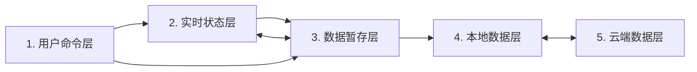

# 持久化模块公共契约

## 1. 这份文档给谁看

本文是所有需要保存业务数据的模块必须遵守的长期公共契约。它规定状态模型、Shared 公共接口、硬约束和推荐设计，不展开登录、IndexedDB、GitHub commit、轮询等内部实现。不保存业务数据的模块不需要使用这套 SDK，也不受本文的 SDK 接入要求约束。

维护已有持久化模块时，阅读本文和该模块自己的契约即可。只有首次接入 SDK 或重做接入边界时，才额外阅读 [新持久化模块接入指南](./new-persistent-module-guide.md)。维护 Shared 内部实现必须先获得用户允许，并阅读 [Shared 与平台维护规范](./shared-maintenance.md)。完整阅读入口见仓库根目录 [AGENTS.md](../AGENTS.md)。

文中的“必须”是硬约束，“不得”是禁止事项，“应该”是通常应遵守的软约束。

## 2. 五层状态模型

模块中的数据按寿命和职责分为五层：



| 层         | 持有什么                                                | 典型寿命           |
| ---------- | ------------------------------------------------------- | ------------------ |
| 用户命令层 | 用户此刻想做的事                                        | 一次命令           |
| 实时状态层 | 正在编辑、拖拽、选择或呈现的页面状态                    | 当前标签页         |
| 数据暂存层 | 当前完整业务 payload，以及用于撤销/重做的可逆业务 event | 当前标签页         |
| 本地数据层 | 已成功保存到当前设备的完整 payload                      | 跨刷新和浏览器重启 |
| 云端数据层 | 用于跨设备同步的完整 payload                            | 跨设备             |

基本方向固定为：

```text
普通编辑：用户命令 → 实时状态 → 业务 event → 数据暂存
撤销重做：用户命令 → 暂存 event 队列 → 当前完整 payload → 实时状态
本地保存：数据暂存的当前完整 payload → 本地数据
页面初始化：本地完整 payload → 空 event 队列 → 实时状态
上传：本地完整 payload → 云端数据
拉取：云端数据 → 本地完整 payload → 新会话
```

实时状态不得绕过暂存层直接保存，暂存状态也不得绕过本地层直接上传。event 只属于当前页面会话；IndexedDB 和 GitHub 都保存完整 payload，不保存撤销 event 队列。

## 3. 模块和 payload 边界

### 3.1 模块身份

每个模块必须有稳定且唯一的 `moduleId`，并匹配：

```text
^[a-z][a-z0-9]*(?:-[a-z0-9]+)*$
```

模块不得自行拼接远端目录、IndexedDB 名称或编辑锁名称；这些都由 Shared 根据 `moduleId` 派生。

### 3.2 完整业务 payload

payload 表示模块的一份完整业务数据，不是 JSON 的同义词。它必须：

- 能通过浏览器 `structuredClone` 和 IndexedDB 往返保存；
- 由模块的 `validate` 校验；
- 不包含 DOM、焦点、选中、pointer、动画等纯实时状态；
- 不包含登录、保存、同步、冲突、revision 等系统元数据。

`Map`、`Set`、`Date`、`ArrayBuffer`、类型化数组和循环引用等非 JSON 值都可以成为 payload，只要模块能稳定校验、比较和编码。函数、DOM 引用、`WeakMap` 等不能可靠持久化的值不得进入 payload。

Mind Map 选择 JSON payload；这是模块选择，不是 Shared 的通用限制。

### 3.3 内容标识和远端编码

模块必须提供同步、确定的 `contentKey(payload)`：

- 业务语义相同必须得到相同字符串；
- 任何需要保存或同步的变化都必须改变字符串；
- 同一个 content key 必须编码出相同的受管文件；
- content key 必须跨刷新保持稳定。

JSON 模块应该使用 SDK 的 `defineJsonModule`，由 SDK 提供规范 JSON content key。非 JSON 模块使用 `defineModule` 并自行实现 `contentKey`。

当前远端受管文件是 UTF-8 文本，但不要求是 JSON，也可以是 Markdown、YAML、CSV 或模块自定义文本格式。`encode` 与 `decode` 必须确定、无损、可往返。

## 4. event 历史与交互结算

### 4.1 event 是什么

一个 `TEvent` 表示一次已经达到提交点的业务变化，例如“新增节点”“把标题从旧值改为新值”或“一次完成的复合移动”。它不是 DOM event，也不是系统保存或同步命令。

event 必须能被 `structuredClone`。它可以携带执行或反向执行所需的业务数据，但不得包含 DOM、函数、token、保存状态、同步状态或其他系统元数据。event 只在当前页面的历史队列中存活，不写入 IndexedDB 或 GitHub。

每个模块必须在 `ModuleDefinition<TPayload, TEvent>.history` 中明确选择历史策略：

```ts
history: {
  capacity: 正整数或 "unlimited",
  apply(payload, event): TPayload,
  invert(event, before, after): TEvent,
}
```

- `capacity` 由模块按业务需要选择，没有通用默认值；正整数按已记录的 event 数量计数，`"unlimited"` 表示页面会话内不设数量上限。
- `apply` 根据完整 payload 和一个 event 计算新的完整 payload。
- `invert` 根据正向 event、变化前 payload 和变化后 payload，生成能恢复变化前内容的反向 event。
- `apply` 和 `invert` 必须是确定、无副作用的纯函数，不得修改传入的 payload/event，不得读取或写入 DOM、网络、存储或可变全局状态。

Shared 会用 `structuredClone` 隔离传入值、回调参数、回调结果和历史中的正反 event。模块仍应把不修改参数视为接口契约，而不是依赖这层隔离掩盖副作用。

### 4.2 记录、撤销和重做规则

- 模块通过 `runtime.dispatch(event)` 提交业务变化；不得直接替换 runtime 的当前 payload。
- 一次语义完整的复合动作只 dispatch 一个 event。
- 如果 `apply` 后的 content key 与当前值相同，该 event 是 no-op：不记录、不调用 `invert`，也不删除现有 redo 分支。
- 撤销到较早位置后 dispatch 一个真实变化，会删除旧 redo 分支，再记录新 event。
- 撤销使用已保存的 inverse event；重做重新使用原 forward event。
- 保存不清空、重建或截断 event 队列。
- 刷新后 event 队列清空，以 IndexedDB 当前完整 payload 建立新会话。
- `apply`、`invert`、`contentKey`、校验或 `structuredClone` 任一步失败，都不得改变 current、队列、撤销/重做位置或保存基线；失败 event 可由模块修正后重试。

### 4.3 settle 与 project

模块必须提供两个回调：

- `settle(reason)`：在 `local-save`、`upload`、`pull`、`remote-change`、`undo` 或 `redo` 前，提交或取消正在进行的实时交互；如结算产生一个业务变化，返回一个 `TEvent`，否则返回 `null`。SDK 会在继续原命令前 dispatch 返回的 event。
- `project(payload, reason)`：初始化、撤销或重做后，用给定完整 payload 重建页面，并把纯实时状态恢复到模块定义的默认状态。

Shared 不注册任何键盘快捷键。按钮、菜单和键盘只是模块把用户命令连接到 `runtime.undo()`、`runtime.redo()`、`runtime.save()` 等方法的方式；通用约束不指定模块必须采用哪些键位。

## 5. 保存、同步和冲突

### 5.1 本地保存

模块只能调用 `runtime.save()`，不得直接访问 IndexedDB。保存成功后，当前 content key 成为新的本地基线；当前内容再次等于该基线时，`dirty` 自动变为 false。

保存失败时必须保留当前 payload、event 历史和 `dirty`，解除页面阻塞，并允许用户重试。

### 5.2 云端同步

模块只能通过 runtime 上传或拉取，不得直接调用 GitHub API。上传内容必须先成为已保存的本地完整 payload；`runtime.upload()` 会在需要时先完成本地保存。

同步只允许四种结果：

| 云端变化 | 本地变化 | 结果                   |
| -------- | -------- | ---------------------- |
| 否       | 否       | 不处理                 |
| 否       | 是       | 等待用户上传           |
| 是       | 否       | 自动拉取并建立新会话   |
| 是       | 是       | 持久化冲突，不自动覆盖 |

如果云端变化与当前本地内容（包括刚由 `settle` 返回并 dispatch 的 event）同时存在，Shared 必须把**当前完整 payload、它的 content hash 和 conflict 信息放在同一个 IndexedDB CAS 事务中持久化**，事务成功后再把该 payload 标记为本地已保存基线。这样刷新后不会丢失冲突的本地一侧。此时 `dirty` 可以变为 false，但它只表示“已经保存到本机”，不表示“已经同步到云端”。

冲突不自动合并，只能由用户明确选择：

- `local-wins`：以本地完整模块覆盖云端受管内容；
- `cloud-wins`：以云端完整模块覆盖本地并刷新页面。

冲突可以暂时不处理并跨刷新保留，但再次上传或主动拉取前必须选择方向。

## 6. 并发、阻塞和安全边界

- 同一个 `moduleId` 同时只允许一个可编辑标签页。
- 不支持安全编辑锁的浏览器不得编辑。
- 本地保存时页面暂时不可交互，但不显示遮罩。
- 上传、拉取和覆盖时由 SDK 自动显示同一份全页 spinner 与模糊遮罩。
- 使用严格 CSP 的模块页面必须以外链 `<link>` 加载 Shared 提供的 `src/shared/ui/operationGate.css`；不得把它复制进模块样式或改成运行时内联样式。
- 模块不得自行复制 spinner、编辑锁、轮询或同步实现。
- 模块不得读取、保存、显示或记录 GitHub token。
- 模块不得把捕获异常任意序列化到 DOM 或日志；用户可见错误应使用模块定义的安全文案。

登录、凭据失效、遮罩清理、轮询和页面关闭时的 Shared 资源释放都由 SDK 负责。模块自己安装的 UI 或键盘监听仍由模块自己释放。

## 7. 模块可使用的公共接口

业务模块只能从 `src/shared/index.ts` 对应的 Shared 根入口导入。主要接口是：

```ts
interface ModuleDefinition<TPayload, TEvent> {
  readonly moduleId: string;
  createEmpty(): TPayload;
  validate(value: unknown): TPayload;
  contentKey(payload: TPayload): string;
  encode(
    payload: TPayload,
  ): ReadonlyMap<string, string> | Promise<ReadonlyMap<string, string>>;
  decode(files: ReadonlyMap<string, string>): TPayload | Promise<TPayload>;
  readonly history: {
    readonly capacity: number | "unlimited";
    apply(payload: TPayload, event: TEvent): TPayload;
    invert(event: TEvent, before: TPayload, after: TPayload): TEvent;
  };
}

interface ModuleRuntime<TPayload, TEvent> {
  readonly state: "starting" | "ready" | "disposing" | "disposed";
  readonly current: TPayload;
  readonly canUndo: boolean;
  readonly canRedo: boolean;
  readonly dirty: boolean;
  dispatch(event: TEvent): TPayload;
  undo(): Promise<TPayload>;
  redo(): Promise<TPayload>;
  save(): Promise<SyncActionResult>;
  upload(): Promise<SyncActionResult>;
  pull(): Promise<SyncActionResult>;
  resolveConflict(
    direction: "local-wins" | "cloud-wins",
  ): Promise<SyncActionResult>;
  pollNow(): Promise<void>;
  getSnapshot(): ModuleRuntimeSnapshot;
  dispose(): Promise<void>;
}

interface ModuleRuntimeSnapshot {
  initialized: boolean;
  sessionDirty: boolean;
  localChangedSinceSync: boolean;
  localSavedAt: string | null;
  knownRemoteRevision: string | null;
  knownRemoteUpdatedAt: string | null;
  lastSyncedRemoteRevision: string | null;
  pendingUpload: {
    localRevision: string;
    contentHash: string;
    nextRemoteRevision: string;
    updatedAt: string;
  } | null;
  conflict: PersistedConflict | null;
}

interface ModuleRuntimeHooks<TPayload, TEvent> {
  settle(reason: SettleReason): TEvent | null | Promise<TEvent | null>;
  project(payload: TPayload, reason: ProjectionReason): void;
  onConflict?(conflict: PersistedConflict): void;
  onSnapshotChange?(snapshot: ModuleRuntimeSnapshot): void;
}

interface PersistedConflict {
  observedRemoteRevision: string | null;
  observedRemoteUpdatedAt: string | null;
  detectedAt: string;
}
```

`localSavedAt` 是当前完整 payload 最近一次成功落到本机的 ISO 时间；`knownRemoteRevision` 与 `knownRemoteUpdatedAt` 是 runtime 当前所知的云端版本及其 ISO 时间。未知值为 `null`。模块可用 `getSnapshot()` 主动读取，也可用可选的 `onSnapshotChange` 更新状态 UI；该观察回调不属于命令事务，回调抛错不得回滚或使已经完成的 runtime 操作失败。

`capacity` 的 `number` 在运行时必须是正整数。模块不得直接依赖 `StagingHistory`、`ModuleLocalStore`、`GitHubGitDataClient`、`RemoteModuleRepository`、`SyncCoordinator`、`OperationGate` 或 `ModuleEditorLease`。这些是 Shared 内部零件，不是模块 API。

首次接入方法见 [新持久化模块接入指南](./new-persistent-module-guide.md)。

## 8. 软约束

模块应该：

- 按用户能理解的语义动作设计 event，而不是机械记录每次 DOM event；
- 让 event 只携带正向/反向业务变化真正需要的数据，避免无意义地复制整个 payload；
- 根据典型 event 大小和期望的撤销深度选择 `capacity`，并用测试固定该选择；
- 让 `validate`、`contentKey`、`encode`、`decode`、`apply` 和 `invert` 保持确定、无副作用；
- 在 `project` 后清空不再可靠的实时引用和选择状态；
- 把保存、上传和冲突操作设计成显式、可重试的用户动作；
- 让模块测试关注业务 event、结算和投影，不重复测试 Shared 内部算法。

## 9. 模块验收清单

- 只从 Shared 根入口导入。
- payload、event 和纯实时状态的边界清楚。
- `validate`、content key、encode/decode 往返有模块测试。
- `history.capacity` 已显式选择为正整数或 `"unlimited"`。
- 每种业务 event 的 `apply` 与 `invert` 可逆、纯净且不修改输入。
- 复合动作只 dispatch 一个 event；no-op、撤销后新分支和容量边界有测试。
- event 队列只活在页面内，刷新后只从完整本地 payload 开始。
- `settle` 覆盖模块在六种 reason 下可能存在的实时交互，并返回 event 或 `null`。
- `project` 会重置模块实时交互状态。
- 保存、上传、拉取和两个冲突方向均通过 runtime 调用。
- 需要版本/状态 UI 时只读取 runtime snapshot；`onSnapshotChange` 只观察，不参与命令成败。
- 模块需要的按钮、菜单或快捷键由模块绑定到 runtime 方法，并在卸载时清理。
- 模块没有自己的 token、IndexedDB、GitHub、轮询、锁或 spinner 实现。
- 页面销毁时调用 `runtime.dispose()`；正常页面关闭由 SDK 自动处理。
