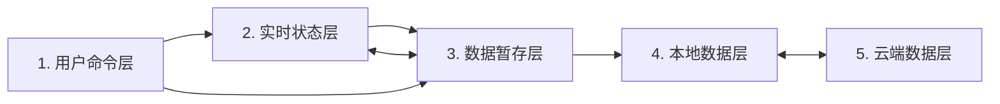

# 通用模块约束

## 1. 这份文档给谁看

本文是所有业务模块开发 agent 的第一份必读文档。它只规定模块必须遵守的结果、Shared 公共接口和推荐的设计方式，不解释登录、IndexedDB、GitHub commit、轮询等内部实现。

模块开发的阅读顺序固定为：

1. 本文；
2. [Shared 模块 SDK 使用指南](./shared-module-sdk-guide.md)；
3. 当前模块自己的设计文档，例如 [Mind Map 专用设计](./mindmap-greenfield-architecture.md)。

文中的“必须”是硬约束，“不得”是禁止事项，“应该”是通常应遵守的软约束。Shared 的维护者另读 [Shared 与平台内部规范](./shared-platform-internals.md)。

## 2. 五层状态模型

模块中的数据按寿命和职责分为五层：



| 层 | 持有什么 | 典型寿命 |
| --- | --- | --- |
| 用户命令层 | 用户此刻想做的事 | 一次命令 |
| 实时状态层 | 正在编辑、拖拽、选择或呈现的页面状态 | 当前标签页 |
| 数据暂存层 | 当前会话可撤销、可保存的完整业务 payload | 当前标签页 |
| 本地数据层 | 已成功保存到当前设备的完整 payload | 跨刷新和浏览器重启 |
| 云端数据层 | 用于跨设备同步的远端副本 | 跨设备 |

基本方向固定为：

```text
普通编辑：用户命令 → 实时状态 → 数据暂存
撤销重做：用户命令 → 数据暂存 → 实时状态
本地保存：数据暂存 → 本地数据
页面初始化：本地数据 → 数据暂存 → 实时状态
上传：本地数据 → 云端数据
拉取：云端数据 → 本地数据 → 新会话
```

实时状态不得绕过暂存层直接保存，暂存状态也不得绕过本地层直接上传。

## 3. 模块和 payload 边界

### 3.1 模块身份

每个模块必须有稳定且唯一的 `moduleId`，并匹配：

```text
^[a-z][a-z0-9]*(?:-[a-z0-9]+)*$
```

模块不得自行拼接远端目录、IndexedDB 名称或编辑锁名称；这些都由 Shared 根据 `moduleId` 派生。

### 3.2 完整业务 payload

payload 表示模块的一份完整业务数据，不是 JSON 的同义词。它必须：

- 能通过浏览器 `structuredClone` 和 IndexedDB 往返保存；
- 由模块的 `validate` 校验；
- 不包含 DOM、焦点、选中、pointer、动画等纯实时状态；
- 不包含登录、保存、同步、冲突、revision 等系统元数据。

`Map`、`Set`、`Date`、`ArrayBuffer`、类型化数组和循环引用等非 JSON 值都可以成为 payload，只要模块能稳定校验、比较和编码。函数、DOM 引用、`WeakMap` 等不能可靠持久化的值不得进入 payload。

当前规划中的 Mind Map 和碎片想法选择 JSON payload；这是模块选择，不是 Shared 的通用限制。

### 3.3 内容标识和远端编码

模块必须提供同步、确定的 `contentKey(payload)`：

- 业务语义相同必须得到相同字符串；
- 任何需要保存或同步的变化都必须改变字符串；
- 同一个 content key 必须编码出相同的受管文件；
- content key 必须跨刷新保持稳定。

JSON 模块应该使用 SDK 的 `defineJsonModule`，由 SDK 提供规范 JSON content key。非 JSON 模块使用 `defineModule` 并自行实现 `contentKey`。

当前远端受管文件是 UTF-8 文本，但不要求是 JSON，也可以是 Markdown、YAML、CSV 或模块自定义文本格式。`encode` 与 `decode` 必须确定、无损、可往返。

## 4. 历史与交互结算

- 历史中的每一步必须是完整 payload，不是 patch、DOM 状态或命令对象。
- 一次语义完整的复合动作只提交一步。
- 相同 content key 的提交不得产生空历史步骤。
- 历史最多保留 100 个版本。
- 从 `A → B → C` 撤销到 B 后提交 D，结果必须是 `A → B → D`。
- 本地保存不清空、重建或截断历史。
- 刷新后不恢复旧历史，只用 IndexedDB 当前 payload 建立一个新起点。

SDK 自动接管精确的 `Ctrl+Z` 和 `Ctrl+Y`，即使焦点在输入框内也操作模块历史。`Ctrl+Shift+Z` 不是重做快捷键。

模块必须提供两个回调：

- `settle`：在保存、上传、撤销或重做前提交或取消正在进行的实时交互；如产生新业务内容，返回完整 payload，否则返回 `null`。
- `project`：初始化、撤销或重做后，用给定 payload 重建页面，并把纯实时状态恢复到模块定义的默认状态。

## 5. 保存、同步和冲突

### 5.1 本地保存

模块只能调用 `runtime.save()`，不得直接访问 IndexedDB。保存成功后，当前 content key 成为新的本地基线；当前内容再次等于该基线时，`dirty` 自动变为 false。

保存失败时必须保留 payload、历史和 `dirty`，解除页面阻塞，并允许用户重试。

### 5.2 云端同步

模块只能通过 runtime 上传或拉取，不得直接调用 GitHub API。上传内容必须先成为已保存的本地完整 payload；`runtime.upload()` 会在需要时先完成本地保存。

同步只允许四种结果：

| 云端变化 | 本地变化 | 结果 |
| --- | --- | --- |
| 否 | 否 | 不处理 |
| 否 | 是 | 等待用户上传 |
| 是 | 否 | 自动拉取并建立新会话 |
| 是 | 是 | 持久化冲突，不自动覆盖 |

冲突不自动合并，只能由用户明确选择：

- `local-wins`：以本地完整模块覆盖云端受管内容；
- `cloud-wins`：以云端完整模块覆盖本地并刷新页面。

冲突可以暂时不处理并跨刷新保留，但再次上传或主动拉取前必须选择方向。

## 6. 并发、阻塞和安全边界

- 同一个 `moduleId` 同时只允许一个可编辑标签页。
- 不支持安全编辑锁的浏览器不得编辑。
- 本地保存时页面暂时不可交互，但不显示遮罩。
- 上传、拉取和覆盖时由 SDK 自动显示同一份全页 spinner 与模糊遮罩。
- 模块不得自行复制 spinner、编辑锁、轮询或同步实现。
- 模块不得读取、保存、显示或记录 GitHub token。
- 模块不得把捕获异常任意序列化到 DOM 或日志；用户可见错误应使用模块定义的安全文案。

登录、凭据失效、遮罩清理、轮询和页面关闭时的资源释放都由 SDK 负责。

## 7. 模块可使用的公共接口

业务模块只能从 `src/shared/index.ts` 对应的 Shared 根入口导入。主要接口是：

```ts
interface ModuleDefinition<T> {
  readonly moduleId: string;
  createEmpty(): T;
  validate(value: unknown): T;
  contentKey(payload: T): string;
  encode(payload: T): ReadonlyMap<string, string> | Promise<ReadonlyMap<string, string>>;
  decode(files: ReadonlyMap<string, string>): T | Promise<T>;
}

interface ModuleRuntime<T> {
  readonly state: "starting" | "ready" | "disposing" | "disposed";
  readonly current: T;
  readonly canUndo: boolean;
  readonly canRedo: boolean;
  readonly dirty: boolean;
  commit(payload: T): T;
  undo(): Promise<T>;
  redo(): Promise<T>;
  save(): Promise<SyncActionResult>;
  upload(): Promise<SyncActionResult>;
  pull(): Promise<SyncActionResult>;
  resolveConflict(direction: "local-wins" | "cloud-wins"): Promise<SyncActionResult>;
  pollNow(): Promise<void>;
  getSnapshot(): ModuleRuntimeSnapshot;
  dispose(): Promise<void>;
}
```

模块不得直接依赖 `ModuleLocalStore`、`GitHubGitDataClient`、`RemoteModuleRepository`、`SyncCoordinator`、`OperationGate` 或 `ModuleEditorLease`。这些是 Shared 内部零件，不是模块 API。

具体接入方法见 [Shared 模块 SDK 使用指南](./shared-module-sdk-guide.md)。

## 8. 软约束

模块应该：

- 按用户能理解的语义动作提交历史，而不是按每次 DOM 事件提交；
- 让 `validate`、`contentKey`、`encode` 和 `decode` 保持确定、无副作用；
- 在 `project` 后清空不再可靠的实时引用和选择状态；
- 把保存、上传和冲突操作设计成显式、可重试的用户动作；
- 让模块测试关注业务结算和投影，不重复测试 Shared 内部算法。

## 9. 模块验收清单

- 只从 Shared 根入口导入。
- payload 边界和纯实时状态边界清楚。
- `validate`、content key、encode/decode 往返有模块测试。
- 复合动作只产生一个完整历史步骤。
- `settle` 覆盖保存、上传、撤销和重做。
- `project` 会重置模块实时交互状态。
- 保存、上传、拉取和两个冲突方向均通过 runtime 调用。
- 模块没有自己的 token、IndexedDB、GitHub、轮询、锁或 spinner 实现。
- 页面销毁时调用 `runtime.dispose()`；正常页面关闭由 SDK 自动处理。
