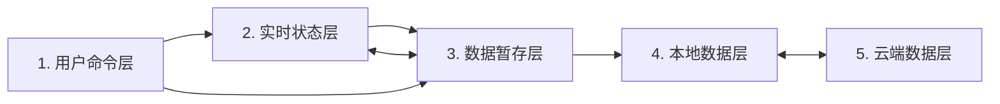

# 通用模块五层模型

## 这份文档解决什么问题

一个交互式模块里的“数据”并不都属于同一种状态。用户正在拖动的对象、可以撤销的文档、已经保存到设备的数据，以及云端副本，拥有不同的寿命和写入规则。如果把它们混在一起，撤销、保存和同步就会互相干扰。

本模型只回答三个基础问题：状态属于哪一层、能存活多久、通常向哪里流动。具体接口、存储格式和同步协议见 [通用模块技术规范](./general-module-technical-spec.md)。

## 五层总览



| 层 | 持有什么 | 典型寿命 |
| --- | --- | --- |
| 用户命令层 | 用户此刻想做的事 | 一次命令 |
| 实时状态层 | 当前页面正在呈现和操作的状态 | 当前标签页会话 |
| 数据暂存层 | 当前会话中可保存的完整业务数据版本 | 当前标签页会话 |
| 本地数据层 | 已经成功保存到当前设备的数据 | 跨刷新、跨浏览器重启 |
| 云端数据层 | 用于跨设备同步的远端数据 | 跨设备、跨本地存储寿命 |

## 1. 用户命令层

用户命令层表达意图，例如输入、点击、拖拽、撤销、保存、上传或拉取。命令本身不是真实业务数据，也不负责长期保存任何状态。

命令通常先交给实时状态层，让界面立即响应；不依赖实时交互的数据命令也可以直接交给数据暂存层。保存和同步命令只负责触发层与层之间的传递。

## 2. 实时状态层

实时状态层保存用户在当前标签页中直接看见和控制的状态。它既可以包含业务数据的即时表现，例如正在编辑的文本和拖动中的坐标，也可以包含纯交互状态，例如选中、悬停、焦点、动画和指针信息。

这一层随页面关闭或刷新而消失。它不是持久化真源，不能绕过数据暂存层直接写入本地或云端。

## 3. 数据暂存层

数据暂存层保存当前会话中准备持久化的完整业务数据。实时交互在明确的提交时点进入这一层；撤销和重做也在这一层切换业务数据版本，再把所选版本投影回实时状态层。

暂存数据只包含业务 payload，不包含焦点、DOM 引用、保存状态或同步元数据。它随当前标签页会话结束而消失；刷新后以本地数据重新建立。

“是否已保存”和“是否已同步”不是手工维护的业务字段，而是当前暂存内容与相应持久化基线的比较结果。

## 4. 本地数据层

本地数据层是当前设备上的持久化边界。只有本地保存成功后，某个暂存版本才成为已保存版本。刷新页面时，本地数据用来建立新的暂存状态和实时状态。

本地层也承接云端拉取结果，并作为上传到云端的数据来源。实时状态和暂存状态都不能直接跳过它写入云端。

## 5. 云端数据层

云端数据层保存可供其他设备获取的远端副本。上传方向是“本地数据 → 云端数据”，拉取方向是“云端数据 → 本地数据”。

云端发生变化时，系统要先判断本地是否也发生了变化：只有本地完全未变时才能自动拉取；两边都变时必须进入显式冲突处理，不能默默覆盖任何一方。

## 基本数据方向

```text
普通编辑：用户命令 → 实时状态 → 数据暂存
撤销重做：用户命令 → 数据暂存 → 实时状态
本地保存：数据暂存 → 本地数据
页面初始化：本地数据 → 数据暂存 → 实时状态
上传：本地数据 → 云端数据
拉取：云端数据 → 本地数据 → 新会话
```

无论模块的业务结构如何变化，都应保持这些归属和方向。模块只需要定义自己的业务 payload、实时交互状态和提交时点。
