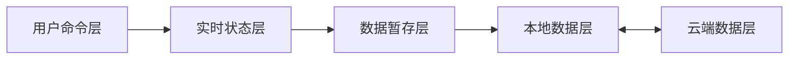

# 通用模块分层模型

## 目的

本文件定义适用于交互式前端模块的通用状态模型。Mind Map、碎片想法以及未来的同类模块可以共享此模型；各项目只需替换自身的业务 schema 与策略。

该模型固定的是**状态归属和跨层方向**，不是框架、类名、数据库或云服务。

## 两个维度

不要把所有箭头都理解为数据层。模块架构包含两个相互垂直的维度：

1. **状态归属层**：某类状态存在哪里、存活多久、谁能写入；
2. **传递机制层**：命令如何路由、数据如何提交、保存、初始化和同步。

## 状态归属层

### 用户命令层

表达用户意图，例如输入、点击、快捷键、拖拽、保存、刷新和同步。它是控制层，不持有业务文档数据。

### 实时状态层

持有当前标签页中用户直接控制和即时观察到的状态。它可以含有可持久化数据的实时表现，也可以含有选中、悬停、焦点、动画、拖拽中间值等纯交互状态。

实时状态层只服务当前会话，不能直接写本地数据层或云端数据层。

### 数据暂存层

持有当前会话中准备保存的可持久化数据，以及 `dirty`、撤销/重做等编辑过程元数据。

它不保存纯实时交互状态；关闭或重载标签页后不应被视为可靠数据来源。

### 本地数据层

持有同一设备上跨重启存在的持久化数据。IndexedDB、文件系统、SQLite 等均可作为实现。

### 云端数据层

持有跨设备可访问的远端数据或版本。GitHub、服务端 API、对象存储等均可作为实现。

## 传递机制层

| 机制 | 标准方向 | 说明 |
| --- | --- | --- |
| 命令分发 | 用户命令 → 实时状态或数据暂存 | 将用户意图转成明确的状态操作。 |
| 实时提交 | 实时状态 → 数据暂存 | 将可保存的实时变更纳入文档，并标 dirty。 |
| 数据投影 | 数据暂存 → 实时状态 | 用文档数据构建、恢复或刷新当前实时界面。 |
| 本地保存 | 数据暂存 → 本地数据 | 提交 dirty 数据到设备持久化存储。 |
| 保存确认 | 本地数据 → 数据暂存 | 成功后确认已保存变更；不应错误清除保存期间的新 dirty。 |
| 初始化 | 本地数据 → 数据暂存 → 实时状态 | 从设备数据建立一个新的会话。 |
| 上传 | 本地数据 → 云端数据 | 将设备中已保存的数据提交到远端。 |
| 拉取 | 云端数据 → 本地数据 | 获取远端数据并写入设备数据。 |

此外应区分三种箭头性质：

- **命令/控制流**：例如 `Ctrl+S` 和“同步”按钮；
- **数据流**：例如暂存数据写入本地数据；
- **确认/状态流**：例如本地保存成功后清除对应 dirty。

## 固定的通用规则

以下规则适合在所有采用本模型的模块中固定：

1. HTML、DOM、SVG 和组件树是视图实现，不是数据真源。
2. 实时状态不得绕过数据暂存层直接写入本地或云端数据。
3. `dirty`、撤销和重做属于数据暂存层，不属于本地或云端数据。
4. 本地数据是设备持久化边界；云端数据只能由本地数据层上传更新。
5. 新会话按“本地数据 → 数据暂存 → 实时状态”初始化。
6. 保存成功确认后才能清除相应 dirty。
7. 实时提交与数据投影是不同机制，不能以“同步”笼统命名。
8. 技术名不属于通用模型：本地数据层可由 IndexedDB 实现，云端数据层可由 GitHub 实现，但二者可替换。

## 由项目自行定义的内容

以下内容必须由每个项目或模块单独声明：

| 项目定义项 | 示例 |
| --- | --- |
| 业务 schema | 脑图节点/箭头；碎片卡片/标签/排序。 |
| 实时状态字段 | 脑图的 resize 中间值；碎片项目的拖拽排序、筛选条件、输入焦点。 |
| 提交时点 | 每次输入、节流、失焦、拖拽结束、显式确认。 |
| dirty 粒度 | 整份文档、单条记录、实体级或字段级。 |
| 撤销/重做语义 | 哪些操作可撤销、合并规则、队列上限。 |
| 本地存储设计 | 数据库表、索引、迁移、序列化和版本格式。 |
| 云端适配设计 | 文件路径、API、远端数据格式、上传批次。 |
| 同步与冲突策略 | 拉取覆盖、合并、提示、版本比较等。 |
| 保存策略 | 手动保存、自动保存、离线重试、保存状态展示。 |

## 采用本模型时的检查清单

为一个新模块开始开发前，应完成以下声明：

1. 该模块的用户命令列表；
2. 实时状态层中的字段和默认状态；
3. 数据暂存层的可持久化 schema；
4. 哪些实时状态会提交到暂存层，以及提交时点；
5. dirty 和撤销/重做的粒度；
6. 本地数据层的实现与初始化流程；
7. 云端数据层的实现与同步入口；
8. 项目自己的同步与冲突规则。

如果模块不需要云端或本地持久化，可以省略对应实现，但不得把该层与其他层的职责混在一起。
