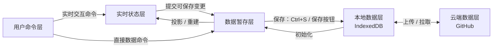

# Mind Map：从零开发的分层模型

## 目的与范围

本文件定义 Mind Map 新模块的逻辑边界，供后续开发 agent 实现时遵守。

- Mind Map 按**从零开发**处理，不以现有 `src/mind-map` 的状态结构作为重构目标或兼容对象。
- 本文件定义状态归属和跨层传递规则；不规定具体框架、类、数据库表或 DOM 实现。
- 同步冲突策略不在本文定义，由模块设计者另行补充。

## 总览



这五层中，用户命令层是控制层；其余四层持有状态或数据。HTML、DOM、SVG 和 CSS 是实时状态的渲染实现，不属于数据层，也不能成为数据真源。

## 状态归属

### 1. 用户命令层

负责表达用户意图，例如点击、快捷键、输入、拖拽、调整大小、创建箭头、撤销、重做、保存、同步和刷新。

它不持有 Mind Map 文档数据，也不直接写入 IndexedDB 或 GitHub。命令会被路由至实时状态层或数据暂存层。

### 2. 实时状态层

实时状态层表示用户当前在画布上直接控制和观察到的所有状态，只在当前标签页会话中存在。

它包括但不限于：

- 文本框当前文本；
- 文本框的实时位置、大小与自动尺寸状态；
- resize、拖拽、连线过程中的中间值；
- 箭头当前的实时状态；
- 选中、未选中、编辑中、悬停、焦点、光标和指针状态。

其中一部分状态有可持久化对应值（例如节点文本、位置、尺寸和箭头端点）；另一部分仅服务于交互（例如选中、pointer ID、拖拽中间值）。实时状态层不得直接写本地数据层或云端数据层。

### 3. 数据暂存层

数据暂存层是当前标签页会话中、等待保存的可持久化文档版本。

- 它只包含将保存到本地数据层的数据类型；不包含选中态、焦点、DOM 引用、pointer ID 等其他实时状态。
- 它与本地数据层、云端数据层的文档数据保持兼容的 schema。
- 它持有 `dirty` 标记和撤销/重做队列。
- 它只在单次标签页打开会话中存在；关闭或重载页面后需要由本地数据层重新初始化。

数据暂存层有两类数据来源：

1. 用户对实时状态层的间接操作，经过“实时状态提交”后写入；
2. 用户直接发出的数据命令，例如撤销、重做、创建或删除文档数据。

### 4. 本地数据层

本地数据层保存同一浏览器中跨页面重启仍然存在的数据。当前预期实现为 IndexedDB。

它通过以下方式获得新文档数据：

- 用户点击保存按钮或按下 `Ctrl+S` 后，接收数据暂存层的 dirty 数据；
- 云端数据层的拉取或同步结果。

本地保存成功后，应向数据暂存层返回确认。只有收到对应保存成功确认的变更才可清除 `dirty`。

### 5. 云端数据层

云端数据层用于跨设备访问和远端版本保存。当前预期实现为 GitHub，但逻辑名称不绑定具体服务。

云端数据层只能通过本地数据层的上传/提交获得新数据，不能直接接收实时状态层或数据暂存层的数据。

## 跨层传递机制

跨层传递机制不是新的数据层。它们不拥有 Mind Map 文档，而是负责命令路由、数据转换、数据传输或成功确认。

| 机制         | 方向                           | 职责                                                    |
| ------------ | ------------------------------ | ------------------------------------------------------- |
| 实时交互处理 | 用户命令 → 实时状态            | 把点击、输入、拖拽、resize 等操作立即反映到画布。       |
| 实时状态提交 | 实时状态 → 数据暂存            | 选择可持久化字段并写入暂存数据，标记对应 dirty。        |
| ctrl+z队列   | 数据暂存 → 实时状态            | 用队列中不同位置的暂存数据初始化画布。                  |
| 本地保存     | 数据暂存 → 本地数据            | 由保存按钮或 `Ctrl+S` 触发，提交 dirty 数据。           |
| 保存确认     | 本地数据 → 数据暂存            | 确认已成功保存的变更，并仅清除这些变更的 dirty。        |
| 初始化       | 本地数据 → 数据暂存 → 实时状态 | 打开新标签页时构建 clean 暂存数据，再构建默认实时状态。 |
| 云端同步     | 本地数据 ↔ 云端数据            | 上传本地数据或拉取云端数据；冲突策略另行定义。          |

## 必须遵守的生命周期

### 打开新标签页

```text
本地数据层
  → 初始化为无 dirty 的数据暂存层
  → 初始化实时状态层
  → 所有文本框和箭头处于未选中状态
```

### 用户交互

```text
用户命令
  → 实时状态层立即更新
  → 在该交互定义的提交时点写入数据暂存层
  → 对应数据标记 dirty
```

提交时点由具体交互定义。例如 resize 可以在结束时提交最终尺寸；文本输入可以在输入、节流、失焦或显式确认时提交。这个选择属于模块实现策略，但必须明确。

### 撤销与重做

```text
Ctrl+Z / Ctrl+Y
  → 操作数据暂存层的撤销/重做队列
  → 得到新的数据暂存版本并标记 dirty
  → 投影到实时状态层
```

撤销和重做本身不直接写本地数据层；之后仍需通过保存将结果持久化。

### 本地保存

```text
保存按钮 / Ctrl+S
  → 数据暂存层提交 dirty 数据到本地数据层
  → 本地数据层确认成功
  → 数据暂存层清除已确认变更的 dirty
```

### 云端同步

```text
上传：本地数据层 → 云端数据层
拉取：云端数据层 → 本地数据层
```

拉取后如何影响当前数据暂存层与实时状态层，以及存在未保存变更时如何处理，由单独的同步冲突规则定义。

## Mind Map 数据分类示例

| 数据                             | 实时状态层 | 数据暂存层             | 本地/云端数据层 |
| -------------------------------- | ---------- | ---------------------- | --------------- |
| 节点文本、位置、尺寸             | 有实时值   | 有可保存值             | 有持久化值      |
| 箭头端点及可保存配置             | 有实时值   | 有可保存值             | 有持久化值      |
| 当前选中节点/箭头                | 有         | 无                     | 无              |
| 正在 resize 的中间尺寸           | 有         | 仅在定义的提交时点写入 | 无中间值        |
| 焦点、光标、pointer ID、DOM 引用 | 有         | 无                     | 无              |
| dirty 标记                       | 无         | 有                     | 无              |
| 撤销/重做队列                    | 无         | 有                     | 无              |
